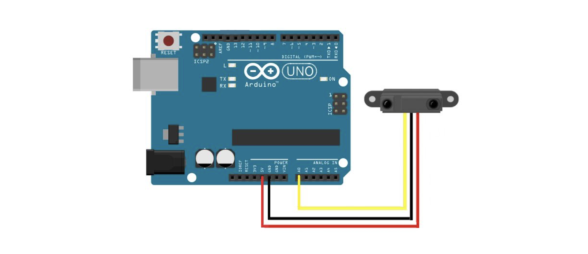

# NRT-Miracle-Rover
UTRA Hacks 2023 project done by Team NRT. Function written in Arduino/C++.

This project involves the creation of an robot using Arduino, designed to navigate a set course. The robot is equipped with sensors, motors, and a microcontroller to enable it to sense its surroundings.

# Components

 - Arduino Board: Arduino Uno Board
 - Motors: 2 servo motors
 - Sensors: one infared sensor one and ultrasonic distance sensor
 - Chassis: custom made chasis using the breadboard as a base
- Power Supply: one 9 Volt battery

# Features

- Obstacle Avoidance: The robot is programmed to detect obstacles using sensors. The ultrasonic sensor can dectects objects.
- Line Following: The ability to follow a predefined path using the infrared sensor.
  
# Hardware design
- Secamtic of the wriring of the  infared sensor.

- Secmatic of the wiring of the ultrasonic distance sensor.
  

# WIP versions of the rover:

The compeleted Miracle Rover:

Created by Sheldon, Martin and Chris.

